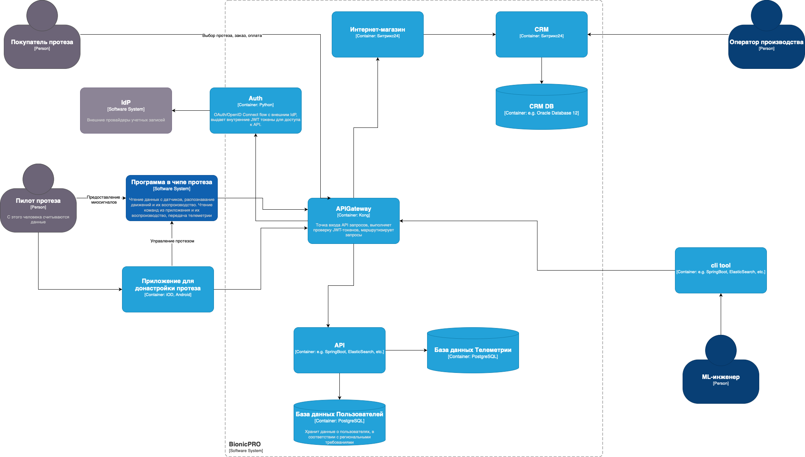
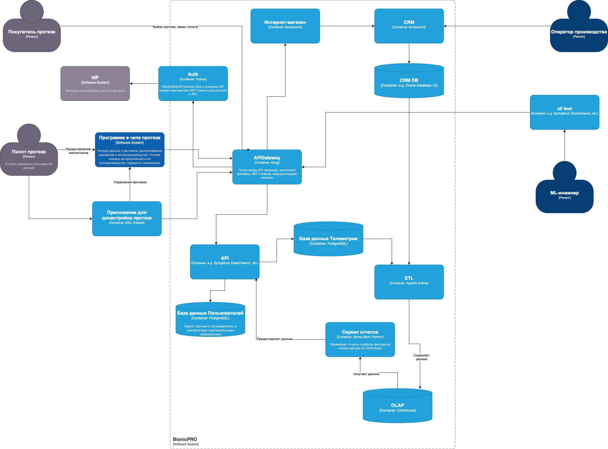

# architecture-bionicpro

Yandex Practicum. Software Architect. Sprint 9

## Задание 1

### Доработаная диаграмма C4



## Задание 2

### Доработаная диаграмма C4



## Запуск проекта

```bash
docker-compose up --build
```

Возможно airflow-scheduler не запуститься с первого раза, в этом случае нужно перезапустить контейнер.

Ручной запуск DAG с определённой датой выполнения

```bash
docker compose exec -it airflow-scheduler bash
airflow dags trigger -e 2025-09-19 reports_etl
airflow dags trigger -e 2025-09-20 reports_etl
airflow dags trigger -e 2025-09-21 reports_etl
```
